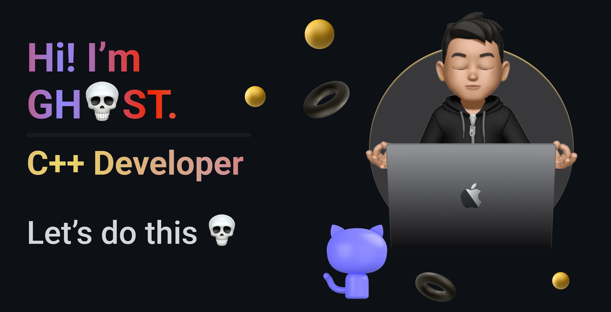

 
     

---

## 🕵️‍♂️ About Me

I'm passionate about cyber security and making the digital world safer. I have experience in C++ programming and love learning new technologies. My journey is driven by curiosity and a desire for knowledge.

---

## 🛠️ Skills

##### Programming Languages
     

##### Web Technologies
   

##### Design
  

##### Operating Systems
   

##### Hardware & Platforms
  

##### Internet Security & Privacy
  

##### Other Skills

---

## 📚 Courses I Studied

- 
- 
- 
- 
- 
- 
---

## 💼 Current Projects

- Working on various cybersecurity projects aimed at identifying and mitigating security vulnerabilities.
- Developing tools to enhance system security and protect against cyber threats.

---

## 🔐Cyber Security

  

### 🚀 Mission

My mission is to safeguard digital information and build robust defenses against cyber threats. I'm committed to continuous learning and staying ahead in the ever-evolving field of cybersecurity.

### 🔍 Explore My Work

Feel free to explore my repositories to see the projects I'm working on and my contributions to the field of cybersecurity.

### 🛠️ Tools & Technologies

- **Penetration Testing Tools:** `Metasploit`, `Nmap`, `Burp Suite`
- **Programming Languages:** `C++`, `Python`
- **Operating Systems:** `Linux`, `Windows`
- **Version Control:** `Git`

 

---
### 🎨 HTML & CSS Projects

Explore my latest HTML and CSS projects below:

- [Project 1](https://0oghost.github.io/0oG170/): html and css portfolio.
- [Project 2](https://0oghost.github.io/0xghost/): html and css portfolio.
  
Feel free to click on the project links to learn more about each one.

---
## 📊 Github Stats

   

  

#### 🏆 GitHub Trophies

#### 🔝 Top Contributed Repo

---

### ✍️ Random Dev Quote

  

### 📫 How to reach me

---

> [!NOTE]\
> **Thank You for visiting my profile! Let's make the digital world safer together.**
